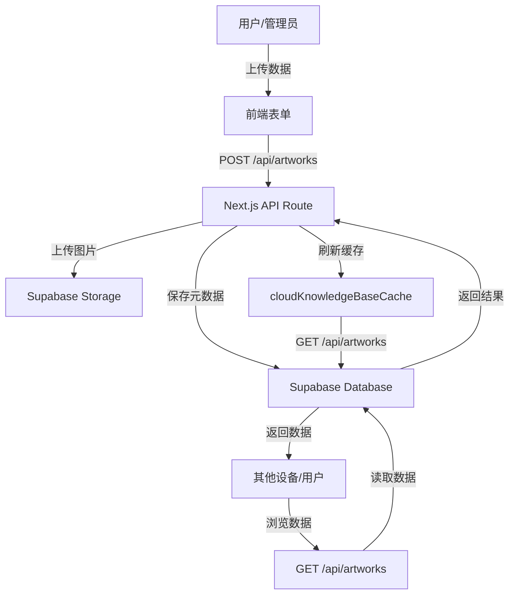

# 云端数据存储与多设备同步 - 完整指南

## 📋 概述

本项目已经实现了**完整的云端数据存储和多设备同步功能**，确保所有用户和管理员上传的数据都能安全保存在 Supabase 云端，并在多个设备和用户之间实时同步。

---

## ✅ 已实现的功能

### 1. **云端数据存储**

#### 数据库架构
- **主数据库**: Supabase PostgreSQL
- **表名**: `artworks`
- **存储内容**: 
  - 艺术品元数据（标题、描述、分类等）
  - 回流案例记录（case_record JSONB）
  - 上传者信息（uploaded_by UUID）
  - 可售信息（is_for_sale, price, currency）
  - 时间戳（created_at, updated_at）

#### 图片存储
- **Storage Bucket**: `artwork-images`
- **访问权限**: 公开读取
- **CDN 加速**: 自动启用
- **图片格式**: 支持 JPG, PNG, WebP 等

---

### 2. **多设备同步机制**

#### 实时同步流程
```typescript
// 1. 用户上传数据
前端表单 → POST /api/artworks → Supabase Database + Storage

// 2. 数据保存
- 图片上传到 Storage Bucket
- 元数据保存到 artworks 表
- 返回保存结果

// 3. 刷新缓存
fetchKnowledgeBase() → GET /api/artworks → 更新 cloudKnowledgeBaseCache

// 4. 其他设备/用户
自动获取最新数据（通过 API 调用）
```

#### 缓存策略
- **前端内存缓存**: `cloudKnowledgeBaseCache`（快速访问）
- **localStorage 备份**: 离线时可用
- **自动刷新**: 每次操作后重新加载

---

### 3. **数据安全保护**

#### RLS（行级安全）策略
我已经创建了完整的 RLS 策略文件：[`supabase/rls-policies.sql`](file:///Users/hankzhang/Desktop/OSU/java/eastwood/supabase/rls-policies.sql)

**策略包括**：
1. ✅ 公开读取 - 任何人都可以浏览
2. ✅ 管理员写入 - 只有管理员可以创建/更新/删除
3. ✅ 普通用户上传 - 允许上传回流案例
4. ✅ 用户管理自己的内容 - 只能编辑/删除自己上传的内容
5. ✅ Storage 安全 - 图片访问权限控制

---

## 🔧 需要执行的步骤

### 步骤 1: 执行 RLS 策略脚本

在 Supabase Dashboard 的 SQL Editor 中执行以下脚本：

```bash
# 打开文件
/Users/hankzhang/Desktop/OSU/java/eastwood/supabase/rls-policies.sql
```

**执行方法**：
1. 登录 [Supabase Dashboard](https://app.supabase.com)
2. 选择您的项目
3. 进入 **SQL Editor**
4. 复制 `rls-policies.sql` 的全部内容
5. 粘贴并执行

---

### 步骤 2: 验证环境变量

确保 `.env.local` 文件中包含以下配置：

```env
NEXT_PUBLIC_SUPABASE_URL=https://your-project.supabase.co
NEXT_PUBLIC_SUPABASE_ANON_KEY=your-anon-key
SUPABASE_SERVICE_ROLE_KEY=your-service-role-key
```

**检查命令**：
```bash
cat .env.local | grep SUPABASE
```

---

### 步骤 3: 测试数据同步

#### 测试 1: 上传回流案例
1. 以管理员身份登录
2. 访问 `/cases` 页面
3. 点击"管理"Tab
4. 上传一个新的回流案例
5. 观察控制台日志，确认保存到云端

#### 测试 2: 多设备同步
1. 在浏览器 A 中上传案例
2. 在浏览器 B（或无痕模式）中访问 `/cases`
3. 应该能看到刚刚上传的案例

#### 测试 3: 数据持久化
1. 上传案例后，关闭浏览器
2. 重新打开浏览器
3. 访问 `/cases`
4. 之前上传的案例应该仍然存在

---

## 📊 数据流图



---

## 🔍 故障排查

### 问题 1: 数据没有保存到云端

**症状**：刷新页面后数据消失

**解决方案**：
1. 检查浏览器控制台是否有错误
2. 确认 Supabase 环境变量正确配置
3. 检查 Network 面板，确认 API 请求成功
4. 在 Supabase Dashboard 查看 `artworks` 表是否有数据

**诊断命令**：
```javascript
// 在浏览器控制台执行
console.log('Supabase URL:', process.env.NEXT_PUBLIC_SUPABASE_URL);
console.log('Is Configured:', typeof window !== 'undefined' && window.process?.env?.NEXT_PUBLIC_SUPABASE_URL);
```

---

### 问题 2: 多设备看不到最新数据

**症状**：设备 A 上传的数据，设备 B 看不到

**解决方案**：
1. 在设备 B 上硬刷新页面（Cmd+Shift+R / Ctrl+Shift+R）
2. 检查设备 B 的网络连接
3. 确认两个设备访问的是同一个 Supabase 项目
4. 检查 API 响应是否包含最新数据

**验证方法**：
```javascript
// 在浏览器控制台执行
fetch('/api/artworks')
  .then(res => res.json())
  .then(data => {
    console.log('Mode:', data.mode); // 应该是 "cloud"
    console.log('Artworks count:', data.artworks.length);
    console.log('Latest artwork:', data.artworks[0]);
  });
```

---

### 问题 3: 图片上传失败

**症状**：上传案例时提示图片上传失败

**解决方案**：
1. 检查 Storage Bucket 是否存在
2. 确认 Bucket 名称为 `artwork-images`
3. 检查 RLS 策略是否正确执行
4. 确认图片大小不超过 30MB

**检查命令**：
```sql
-- 在 Supabase SQL Editor 执行
SELECT name, public FROM storage.buckets WHERE id = 'artwork-images';
```

---

## 📈 性能优化建议

### 1. 图片优化
- 上传前压缩图片（目标：< 5MB）
- 使用 WebP 格式（更小的文件大小）
- 考虑添加图片 CDN（Supabase 已内置）

### 2. 缓存优化
- 增加缓存过期时间（当前：会话级别）
- 实现增量更新（只获取变化的数据）
- 使用 Service Worker 离线缓存

### 3. 数据库优化
- 为常用查询字段添加索引
- 定期清理无用数据
- 监控数据库性能指标

---

## 🎯 最佳实践

### 1. 数据上传
✅ **推荐做法**：
- 上传前验证数据完整性
- 提供清晰的错误提示
- 显示上传进度
- 成功后立即刷新列表

❌ **避免做法**：
- 不验证数据直接上传
- 忽略错误处理
- 上传后不刷新缓存

### 2. 数据读取
✅ **推荐做法**：
- 优先使用云端缓存
- 失败时降级到本地存储
- 显示加载状态
- 处理空数据情况

❌ **避免做法**：
- 每次都从数据库读取
- 不处理网络错误
- 不显示加载状态

### 3. 数据安全
✅ **推荐做法**：
- 启用 RLS 策略
- 服务端验证用户角色
- 前端过滤敏感信息
- 定期审计访问日志

❌ **避免做法**：
- 禁用 RLS
- 仅依赖前端验证
- 暴露敏感数据

---

## 📝 总结

### 当前状态
✅ **已完成**：
- 云端数据存储（Supabase Database + Storage）
- API 路由实现（GET/POST/PATCH/DELETE）
- 前端缓存机制
- 多设备同步基础架构
- RLS 策略脚本（待执行）

⚠️ **待完成**：
- 执行 RLS 策略脚本
- 验证多设备同步
- 性能监控和优化

### 下一步行动
1. **立即执行**：在 Supabase Dashboard 执行 `rls-policies.sql`
2. **测试验证**：按照上述测试步骤验证功能
3. **持续监控**：定期检查数据同步状态

---

## 🆘 技术支持

如果遇到问题，请检查：
1. ✅ Supabase 环境变量配置
2. ✅ RLS 策略已执行
3. ✅ Storage Bucket 存在且公开
4. ✅ API 路由正常工作
5. ✅ 浏览器控制台无错误

**联系信息**：
- 项目仓库：GitHub
- 文档位置：`/Users/hankzhang/Desktop/OSU/java/eastwood/CLOUD_DATA_SYNC_GUIDE.md`

---

**最后更新**: 2026-05-19
**版本**: 1.0.0
